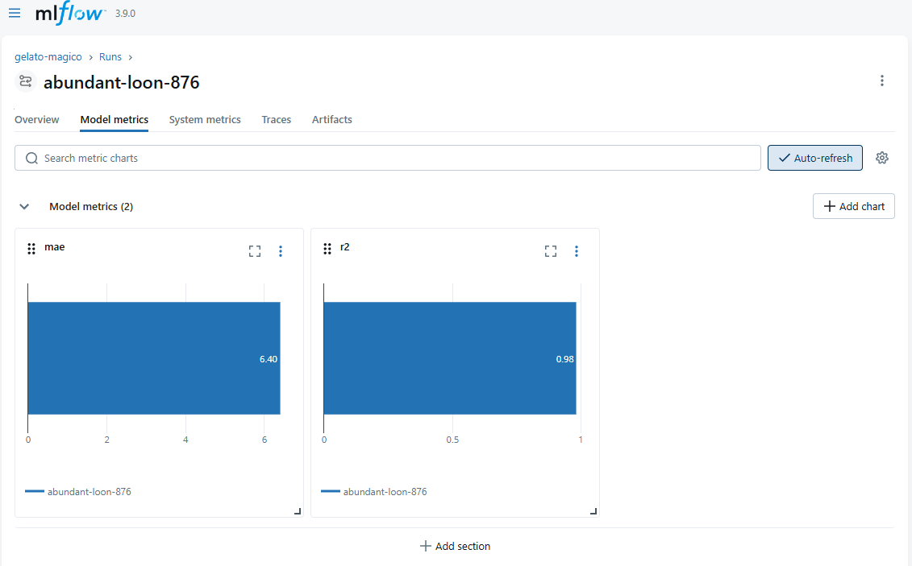
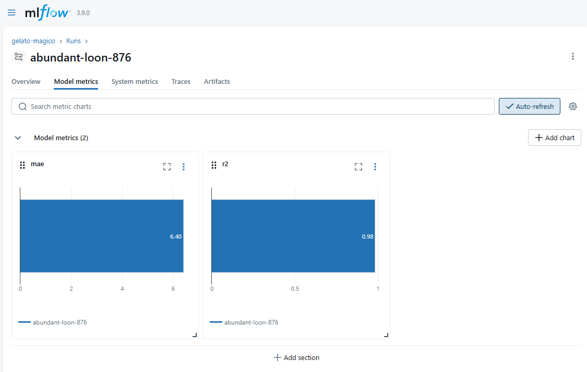
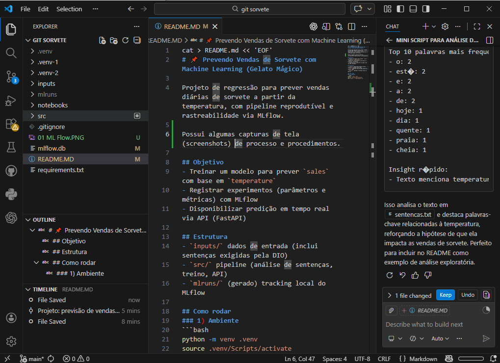
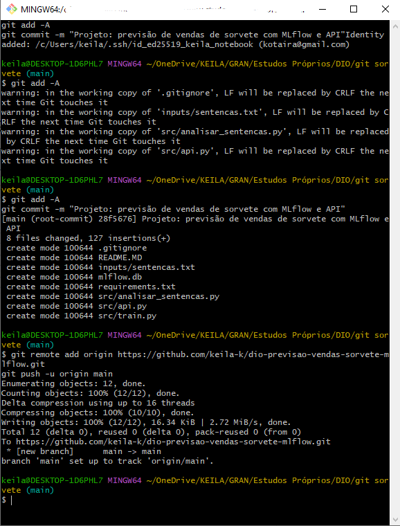

cat > README.md << 'EOF'
# 📌 Prevendo Vendas de Sorvete com Machine Learning (Gelato Mágico)

Projeto de regressão para prever vendas diárias de sorvete a partir da temperatura, com pipeline reprodutível e rastreabilidade via MLflow.

Possui algumas capturas de tela (screenshots) de processo e procedimentos.

## Objetivo
- Treinar um modelo para prever `sales` com base em `temperature`
- Registrar experimentos (parâmetros e métricas) com MLflow
- Disponibilizar predição em tempo real via API (FastAPI)

## Prints

### MLflow




### Ambiente



## Estrutura
- `inputs/` dados de entrada (inclui sentenças exigidas pela DIO)
- `src/` pipeline (análise de sentenças, treino, API)
- `mlruns/` (gerado) tracking local do MLflow

## Como rodar
### 1) Ambiente
```bash
python -m venv .venv
source .venv/Scripts/activate
pip install -r requirements.txt

